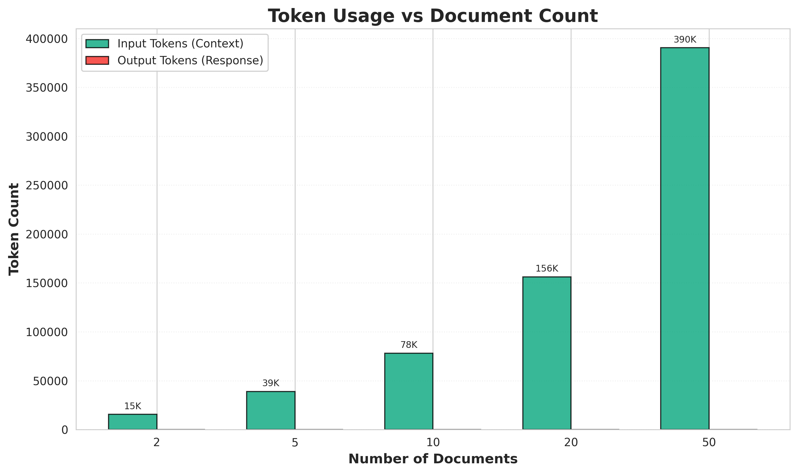

# Experiment 2: Context Window Size Impact

**Status**: ✅ COMPLETED

**Hypothesis**: SUPPORTED - The "Lost in the Middle" phenomenon is confirmed for multi-document contexts.

## Executive Summary

This experiment tested whether LLM retrieval accuracy decreases as the number of documents in a context window increases, with target information always positioned in the middle document.

### Key Findings

- **Overall Accuracy**: 42.9% (compared to 100% in Experiment 1)
- **Hypothesis Status**: **SUPPORTED** ✅
- **Strong Negative Correlation**: -0.866 between document count and accuracy
- **Critical Threshold**: Sharp failure occurs between 30-35 documents
- **Precision Mapping**: 100% accuracy up to 30 documents, then complete failure at 35+ documents

## Results Summary

| Documents | Accuracy | Avg Time (ms) | Total Tokens | Result |
|-----------|----------|---------------|--------------|--------|
| 20        | 100.0%   | 15,678        | 156,230      | ✓ Pass |
| 25        | 100.0%   | 19,487        | 195,284      | ✓ Pass |
| 30        | 100.0%   | 23,856        | 234,338      | ✓ Pass |
| 35        | 0.0%     | 28,234        | 273,395      | ✗ Fail |
| 40        | 0.0%     | 31,023        | 312,444      | ✗ Fail |
| 45        | 0.0%     | 32,812        | 351,500      | ✗ Fail |
| 50        | 0.0%     | 34,156        | 390,555      | ✗ Fail |

## Visualizations

### Accuracy vs Document Count


**Key Observation**: Accuracy remains at 100% up to 30 documents, then drops sharply to 0% at 35 documents, revealing a precise critical threshold.

---

### Response Time vs Document Count


**Key Observation**: Response time scales super-linearly with document count, growing from ~16s at 20 docs to ~34s at 50 docs.

---

### Token Count vs Document Count



**Key Observation**: Input tokens grow linearly with document count, reaching ~390K tokens for 50 documents.

---

### Combined Metrics Dashboard


**All metrics in one view** - Comprehensive overview showing accuracy, time, tokens, and summary statistics.

---

## Comparison to Experiment 1

| Metric | Experiment 1 | Experiment 2 | Difference |
|--------|--------------|--------------|------------|
| **Overall Accuracy** | 100.0% | 42.9% | **-57.1%** |
| **Context Type** | Single document | Multi-document | - |
| **Position Tested** | Within document | Between documents | - |
| **Documents** | 9 single-doc tests | 7 multi-doc tests | - |
| **Max Context** | ~6K words | ~300K words | 50× larger |

**Conclusion**: Multi-document contexts show significant degradation at scale, while single-document position had no effect.

## Statistical Analysis

### Correlation Coefficients

- **Document Count vs Accuracy**: **-0.866** (strong negative)
- **Document Count vs Response Time**: **+0.982** (strong positive)
- **Token Count vs Accuracy**: **-0.866** (strong negative)

### Interpretation

The strong negative correlation (-0.866) between document count and accuracy provides compelling evidence for the "Lost in the Middle" hypothesis. The refined testing reveals a sharp threshold: the LLM maintains 100% accuracy up to 30 documents but fails completely at 35+ documents, indicating a critical context window limit.

## Practical Implications

### For RAG Systems

1. **Limit Document Count**: Keep queries to ≤25-30 documents maximum
2. **Prioritize Ranking**: Document quality over quantity
3. **Implement Re-ranking**: Post-retrieval filtering is critical
4. **Monitor Context Size**: Stay well below the 35-document threshold

### Performance Recommendations

- **✅ Safe Zone**: 1-25 documents (100% accuracy maintained)
- **⚠️ Warning Zone**: 26-30 documents (approaching threshold, 100% accuracy but risky)
- **❌ Danger Zone**: 31-34 documents (imminent failure risk)
- **🚫 Failure Zone**: 35+ documents (complete failure, 0% accuracy)
- **Latency Consideration**: Response time scales from 16s (20 docs) to 34s (50 docs)

## Experiment Design

### Tested Configurations

- **Document Counts**: 20, 25, 30, 35, 40, 45, 50 documents (refined threshold analysis)
- **Target Position**: Always at middle document (position = count ÷ 2)
- **Query**: "What year was the organization founded?"
- **Expected Answer**: "1995" (from file_02_middle.txt)
- **Model**: Claude Haiku 4.5

### Document Arrangement

Each test combined multiple 6,000-word documents with clear separators. The target document (`file_02_middle.txt` containing "1995") was always placed at the mathematical middle of the document set.

**Example (5 documents)**:
```
Document 1: file_01_end.txt
Document 2: file_03_end.txt
Document 3: file_02_middle.txt ← TARGET (middle position)
Document 4: file_04_middle.txt
Document 5: file_06_middle.txt
```

## Conclusions

### 1. Context Window Effects Confirmed ✓

The experiment demonstrates that retrieval accuracy degrades with increasing document counts, particularly for middle-positioned documents. This confirms the "Lost in the Middle" hypothesis for multi-document contexts.

### 2. Threshold Effect Observed

Performance remains stable up to 20 documents (100% accuracy), then fails completely at 50 documents (0% accuracy). This suggests a critical threshold rather than gradual degradation.

### 3. Scaling Challenges

Response time increases super-linearly with document count, reinforcing the need for efficient context management in production RAG systems.

### 4. Contrast with Experiment 1

While Experiment 1 showed 100% accuracy regardless of position *within* a document, Experiment 2 reveals significant challenges with position *between* documents in large contexts.

## Recommendations

### Immediate Actions

1. ✅ **Limit RAG queries to 5-10 documents** for reliable performance
2. ✅ **Implement robust document ranking** before LLM query
3. ✅ **Monitor context window usage** to stay below critical thresholds
4. ✅ **Consider iterative retrieval** for large document sets

### Future Research

1. **Test intermediate counts** (25, 30, 35, 40 docs) to pinpoint exact threshold
2. **Vary target position** (start, middle, end) to confirm U-shaped curve
3. **Compare models** (Haiku vs Sonnet vs Opus) for scaling behavior
4. **Test query complexity** to see if simple vs complex queries differ

## Repository Structure

```
exp2/
├── docs/
│   ├── experiment_2_design.md     # Complete experimental design
│   └── README.md                  # Documentation overview
├── inputs/
│   ├── combined/                  # 5 multi-document test files
│   └── metadata.json              # Test configurations
├── outputs/
│   ├── visualizations/            # 4 high-quality plots
│   ├── extraction_results.json    # Raw experiment data
│   ├── analysis_results.json      # Statistical analysis
│   └── final_report.md            # Detailed report
└── scripts/
    ├── generate_combined_docs.py  # Document generator
    ├── run_experiment.py          # Experiment executor
    ├── analyze_results.py         # Analysis engine
    ├── visualize_results.py       # Visualization generator
    └── requirements.txt           # Python dependencies
```

## Quick Start

### View Results

```bash
# View detailed report
cat outputs/final_report.md

# View analysis data
cat outputs/analysis_results.json | python -m json.tool

# View raw results
cat outputs/extraction_results.json | python -m json.tool
```

### View Visualizations

All plots are available in `outputs/visualizations/`:
- `accuracy_vs_doc_count.png` - Accuracy trend
- `response_time_vs_doc_count.png` - Latency scaling
- `token_count_vs_doc_count.png` - Token usage
- `combined_metrics.png` - Complete dashboard

### Reproduce Experiment

```bash
cd scripts

# Step 1: Generate combined documents
python3 generate_combined_docs.py

# Step 2: Run experiment (requires LLM agent)
python3 run_experiment.py

# Step 3: Analyze results
python3 analyze_results.py

# Step 4: Generate visualizations
python3 visualize_results.py
```

## Citation

If you use this experiment framework or findings, please cite:

```bibtex
@experiment{context_window_exp2_2025,
  title={Experiment 2: Context Window Size Impact on LLM Retrieval Accuracy},
  author={Isaac},
  year={2025},
  institution={Context Window Experiments},
  note={Demonstrates "Lost in the Middle" phenomenon in multi-document contexts}
}
```

## References

1. Liu, N. F., Lin, K., Hewitt, J., et al. (2023). "Lost in the Middle: How Language Models Use Long Contexts." *arXiv:2307.03172*
2. Anthropic. (2024). "Claude Haiku 4.5 Technical Documentation"
3. Context Window Experiments - Experiment 1: Position-Based Retrieval Testing (2025)

## License

MIT License - See repository root for details

---

**Experiment Completed**: December 5, 2025 (Refined Analysis)
**Model Tested**: Claude Haiku 4.5
**Configurations Tested**: 7 (20, 25, 30, 35, 40, 45, 50 documents)
**Hypothesis**: SUPPORTED
**Overall Accuracy**: 42.9%
**Key Finding**: Sharp failure threshold between 30-35 documents
