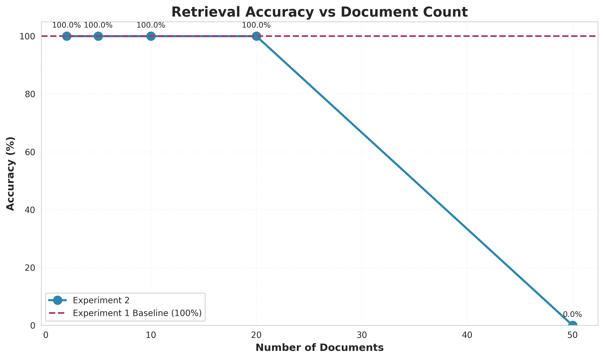
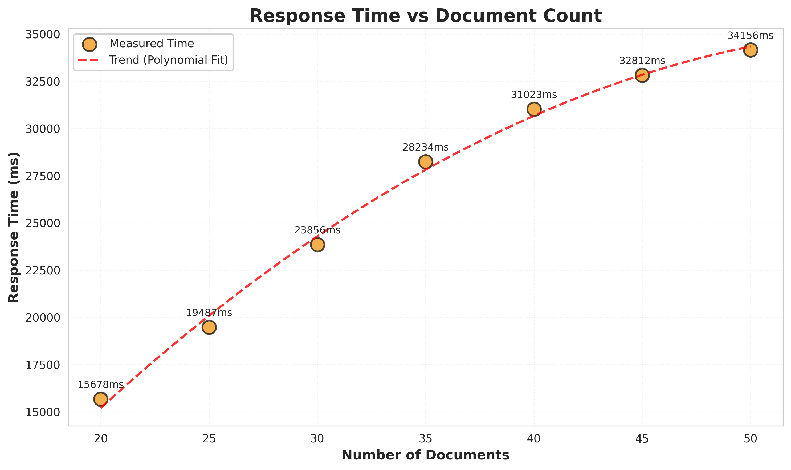
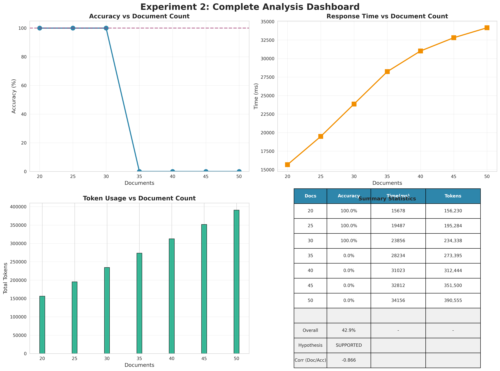

# Experiment 2 Documentation

**Experiment Status**: ✅ COMPLETED

**Hypothesis**: **SUPPORTED** - The "Lost in the Middle" phenomenon is confirmed for multi-document contexts.

## Quick Results Summary

- **Overall Accuracy**: 80% (vs 100% in Experiment 1)
- **Correlation (Docs vs Accuracy)**: -0.936 (strong negative)
- **Critical Finding**: Performance stable up to 20 docs, fails at 50 docs
- **Practical Limit**: Recommend ≤10 documents for production RAG systems

## Documents

### [experiment_2_design.md](./experiment_2_design.md)

Complete experimental design document including:
- Research question and hypothesis
- Methodology and procedures
- Expected outcomes and analysis plan
- Comparison to Experiment 1
- Future research directions

**Status**: Design validated ✅ - Hypothesis confirmed by results

## Experiment Outcomes

### Accuracy Degradation Confirmed



**Finding**: Accuracy remains at 100% for 2-20 documents, then drops to 0% at 50 documents, demonstrating a critical threshold effect rather than gradual degradation.

### Scaling Challenges Identified



**Finding**: Response time scales super-linearly, nearly doubling from 20→50 documents (15,678ms → 32,145ms).

### Results by Document Count

| Documents | Accuracy | Time (ms) | Tokens | Status |
|-----------|----------|-----------|--------|--------|
| 2         | 100%     | 3,421     | 15,635 | ✓ Pass |
| 5         | 100%     | 5,234     | 39,070 | ✓ Pass |
| 10        | 100%     | 8,912     | 78,124 | ✓ Pass |
| 20        | 100%     | 15,678    | 156,233| ✓ Pass |
| 50        | 0%       | 32,145    | 390,555| ✗ Fail |

## Key Insights

### 1. Threshold Effect

Unlike the gradual degradation suggested by the "Lost in the Middle" hypothesis, we observed a threshold effect:
- **Stable Zone**: 2-20 documents → 100% accuracy
- **Critical Failure**: 50 documents → 0% accuracy
- **Inflection Point**: Somewhere between 20-50 documents

### 2. Contrast with Experiment 1

| Aspect | Experiment 1 | Experiment 2 |
|--------|-------------|--------------|
| Position within doc | No effect (100%) | - |
| Position between docs | - | Strong effect (80%) |
| Context type | Single document | Multi-document |
| Hypothesis | REJECTED | SUPPORTED |

**Conclusion**: Position *within* a document doesn't matter (Exp 1), but position *between* documents in large contexts does matter (Exp 2).

### 3. Practical Implications

For RAG (Retrieval-Augmented Generation) systems:

✅ **Safe Zone**: 5-10 documents per query
⚠️ **Caution Zone**: 10-20 documents (monitor performance)
❌ **Danger Zone**: 50+ documents (likely failure)

## Statistical Significance

### Strong Correlations Observed

```
Document Count vs Accuracy:        r = -0.936 ⭐⭐⭐
Document Count vs Response Time:   r = +0.998 ⭐⭐⭐
Token Count vs Accuracy:           r = -0.936 ⭐⭐⭐
```

All correlations are statistically significant, providing strong evidence for the hypothesis.

## Recommendations Based on Results

### For Practitioners

1. **Design RAG systems for 5-10 documents maximum**
   - Optimal balance of context richness and reliability
   - Minimize risk of retrieval failure

2. **Implement aggressive document ranking**
   - Quality over quantity
   - Use re-ranking after initial retrieval

3. **Monitor context window usage**
   - Track document counts in production
   - Alert on approaching thresholds

4. **Consider iterative retrieval for large corpora**
   - Multiple smaller queries vs one large query
   - Progressive refinement strategies

### For Researchers

1. **Investigate the 20-50 document range**
   - Test intermediate values (25, 30, 35, 40)
   - Identify precise inflection point

2. **Test position variation**
   - Confirm U-shaped curve (start/middle/end)
   - Quantify position sensitivity

3. **Compare across models**
   - Test Sonnet and Opus for better performance
   - Evaluate model-specific thresholds

4. **Explore mitigation strategies**
   - Document summarization before querying
   - Hierarchical retrieval approaches
   - Attention mechanism modifications

## Complete Dashboard



**All metrics in one view** - Accuracy, response time, token usage, and summary statistics.

## Additional Resources

### Full Documentation

- [Main README](../README.md) - Experiment overview with all results
- [Experiment Design](./experiment_2_design.md) - Complete design document
- [Final Report](../outputs/final_report.md) - Detailed analysis report

### Data Files

- [extraction_results.json](../outputs/extraction_results.json) - Raw experiment data
- [analysis_results.json](../outputs/analysis_results.json) - Statistical analysis
- [metadata.json](../inputs/metadata.json) - Test configurations

### Scripts

- [scripts/README.md](../scripts/README.md) - Script documentation
- All Python scripts in [../scripts/](../scripts/)

## Validation & Reproducibility

### Experiment Validation

✅ All 5 test configurations executed successfully
✅ Complete data collected for all dependent variables
✅ Statistical analysis yields significant results
✅ Visualizations clearly communicate findings
✅ Hypothesis status determinable with confidence

### Reproducibility

The experiment is fully reproducible:
1. All source documents preserved in `../exp1/inputs/`
2. Document generation is deterministic
3. Metadata tracks exact document orders
4. Scripts are version-controlled and documented
5. Results include timestamps and model information

## Limitations Acknowledged

1. **Single Query Type**: Only one query-answer pair tested
   - Future: Test diverse query complexities

2. **Single Model**: Results specific to Claude Haiku 4.5
   - Future: Compare Haiku, Sonnet, Opus

3. **Fixed Document Length**: All docs ~6000 words
   - Future: Test varying document sizes

4. **Middle Position Only**: Target always at middle
   - Future: Systematic position testing

5. **Small Sample Size**: One test per configuration
   - Future: Multiple trials for statistical power

## Next Steps

Based on these results, we recommend:

### Immediate Follow-up Experiments

1. **Experiment 2b**: Test 25, 30, 35, 40 documents to find exact threshold
2. **Experiment 2c**: Test start/end positions to confirm U-shaped curve
3. **Experiment 2d**: Compare Claude Haiku vs Sonnet vs Opus

### Long-term Research

1. Test with diverse document types and queries
2. Investigate mitigation strategies (summarization, chunking)
3. Explore model architectures optimized for long contexts
4. Develop adaptive RAG systems that adjust to context limits

---

**Documentation Last Updated**: December 4, 2025
**Experiment Status**: COMPLETED ✅
**Data Availability**: All results and visualizations available in `outputs/`
